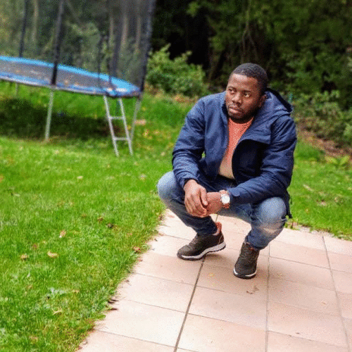
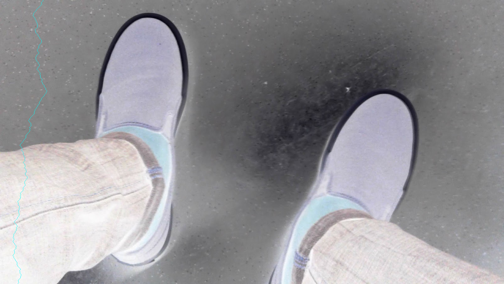

# Kleine Bibliothek für Bildverarbeitung

Mit dieser Bibliothek kann zum Beispiel:
1. Bilder geladen und geschrieben.
2. Bildhistogramm in der Konsole ausgeben ([histogramm](data/screenshot.png)).
3. Sobel-([sobel](data/sobel.png)), Gauß-Filter ([gauß](data/gaussian_blur.png)), Boxfilter und allgemeine Filteroperation ausgeführt werden.
4. Bilder können auch addiert (**+**), subtrahiert (**-**), multipliziert (**x**)([multiply](data/corner.png))


[comment]: <> (![git]&#40;data/gif.gif&#41;)


# Bild erzeugten
```c
Image(int n_rows, int n_cols, int n_channels);
```
- *n_rows*: Die Anzahl von Zeilen.
- *n_cols*: Die Anzahl von Spalten.
- *n_channels*: Die Anzahl von Kanälen.

```c
Image(const char *filename);
```
- *filename*: Das Path zur Bilddatei.
```c
Image(const Image &image);
```
- *image*: Das Bild, das den Inhalt kopiert werden soll.

| Kommand | Beispiel | Kommand | Beispiel |
|------|----------|-----|---|
| image.blur() |  | image.invert() | 
